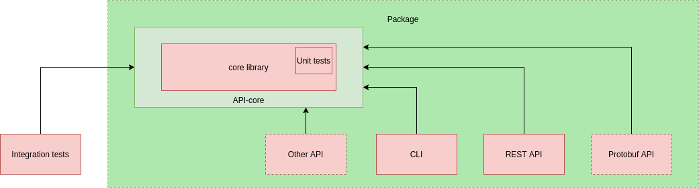

# Template for private python service

 
This is a [cookiecutter](https://github.com/cookiecutter/cookiecutter) template for an internal REST API service, written in Python, inspired by [layout-golang](https://github.com/golang-standards/project-layout). The stack is based on [FastAPI](https://github.com/tiangolo/fastapi) and [uvicorn](https://www.uvicorn.org/) and runs on [docker](https://www.docker.com/) and docker-compose.

## Service layout

Below is the 1000ft structure of project's modules. Here, red ones are private, green ones are public. Package consists of  both public and private sources.

We have some modules:

- **Package**. Publish to pypi registry
- **Server**. Server has some submodules for configuration handlers, logging and exceptions. Server has all business logic.
- **Integration tests**. Integration tests communicate with server as black box.

**Notice**. Bad practice import any function from server module.  

Package consists

Read more on the project's main principles [here](%7B%7B%20cookiecutter.service%20%7D%7D/docs/structure.md).
you can also read more on our approach [here](https://github.com/U-Company/notes).

## Service

Our service has built-in:

- [prometheus endpoint](https://github.com/prometheus/client_python)
- [vault-client](https://github.com/U-Company/vault-client)
- healthcheck
- [docker](https://www.docker.com/) and docker-compose for local development and deploying
- isolated docker development
- loguru for logging
- autogeneration of README.md for your service
- swagger from FastAPI /docs
- [FastAPI](https://github.com/tiangolo/fastapi) as service
- [Uvicorn](https://www.uvicorn.org/) as asgi server
- console server
- templates for unit and integration tests
- interface for control your service via makefile
- completely to publishing package (private pypi-registry)
- completely to publishing dockerfile (private docker-registry)
- basic token (api-key) [authentication](https://medium.com/data-rebels/fastapi-authentication-revisited-enabling-api-key-authentication-122dc5975680)

## Usage

To use this project, you need to install [cookiecutter](https://github.com/cookiecutter/cookiecutter):

    pip install cookiecutter
    cookiecutter https://github.com/U-Company/python-private-service-layout.git

Next, you need to have `docker` and `docker-compose`:

    sudo apt-get install make docker.io docker-compose

[Here](%7B%7B%20cookiecutter.service%20%7D%7D/docs/commands.md) you cand find all available commands for communicate with service with a command line.

If you have any errors, you can read about in documentary after project generation. You can communicate with Egor Urvanov by UrvanovCompany@yandex.ru or in telegram (@egor_urvanov)

For the full tutorial of service generation you can read [here](docs/tutorial.md).

## Execution and infrastructure

To deploy service **WITHOUT** dependencies, just run the docker-compose from the root via make:

    make run

To deploy service **WITH** dependencies, just run the docker-compose from the root via make:

    make run-full
    
(Default deployment is based on  [infrastructure](https://github.com/U-Company/infrastructure))
    
That's it! Enjoy

